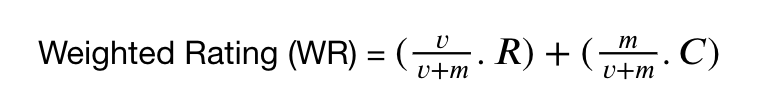
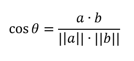

# Movie Recommendation System

This program built using two methods that is Weighted Average Rating and Content-based Filtering. It provides every details of the recommended movie such as title, genre, release date, runtime, rating, and votes. 

## Weighted Average Rating

The ideas behind this recommendation system:
1. Movies that are more popular will have a greater chance of being liked by the average user as well
2. This model does not provide personalized recommendations for each type of user
3. The implementation of this model is also quite easy, all we need to do is sort the films by rating and popularity and show the top films from the list of films.

### Formula of IMDB with Weighted Rating (WR)

## Content-based Filtering

Content-based filtering uses movie feature to recommend other movies similar to what movie does user recently watch or search so this technique doesn't requeire other user's data during recommendations to one user. This technique using similarity metric, for it case using Cosine Similarity, to determine how similar is a vector to a given vector. Then, the top few are recommended.

### Formula of Cosine Similarity

